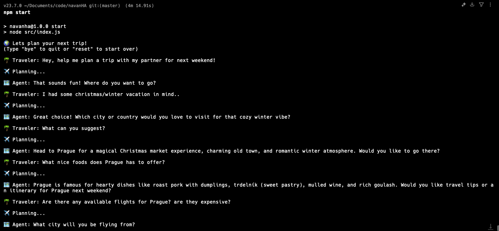
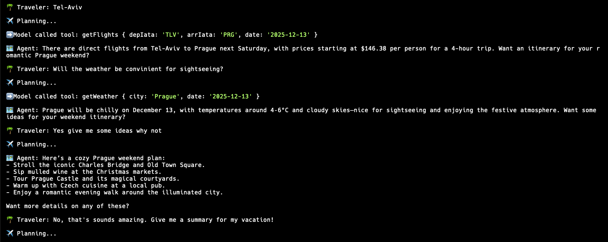
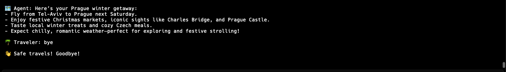

# ✈️ Travel Trip Planner Agent

Plan a trip in seconds—like chatting with a smart, practical travel partner.

This project is a CLI-based AI travel assistant that helps you explore destinations, check real-time flights, and understand weather conditions—all through a simple conversation.  
Instead of long, generic answers, it focuses on clear, decision-ready suggestions powered by live data.

---

## 🌍 What You Can Do

- 💬 Chat your way to a trip plan  
  Ask naturally: “Where should I go next weekend?”

- ✈️ Check real flight options (live)  
  Uses the Amadeus API to fetch actual flight data

- 🌦️ Get weather forecasts (live)  
  So you know what to expect before booking

- Get concise, useful answers  
  No fluff—just what you need to decide

- Have contextual conversations  
  The agent remembers what it already fetched

---

## How It Works

At its core, this is a tool-using AI agent:

- Uses OpenAI o1 with automatic tool selection (tool_choice: "auto")
- Decides when to call APIs vs. answer directly
- Combines:
  - Flights data (Amadeus)
  - Weather data (Open-Meteo)
- Returns short, grounded answers (no hallucinated live data)

To stay efficient and safe:
- Max 5 tool iterations (MAX_ITERATIONS)
- Keeps in-memory context (conversation + tool results)

---

## 🧩 Architecture Overview

### LLM Layer
- OpenAI o1 via official JavaScript SDK
- System prompt defines:
  - when to fetch live data
  - how to stay concise
  - how to avoid guessing real-time info

### Tools

- Flights  
  Amadeus Flight Offers API (OAuth flow + search endpoint)

- Weather  
  Open-Meteo (geocoding + forecast endpoints)

### Context Management

- Stores:
  - conversation history
  - previous tool results  
- Enables follow-up questions like:
  “What about the weather there?” (without repeating the city)

---

## ⚠️ Scope & Limitations

- No booking or reservations  
- No persistent storage (in-memory only)  
- Focused on planning, not execution

---

## 🚀 Getting Started

1. Install dependencies
npm install

2. Create .env
OPENAI_API_KEY=your_key  
AMADEUS_API_KEY=your_key  
AMADEUS_API_SECRET=your_secret  

3. Run the agent
npm start

---

## 💬 Example Interaction

🌴 Traveler: I want a romantic winter trip next weekend

🗺️ Agent: Prague is a great choice—Christmas markets, cozy vibe.  
Would you like to check flights?

🌴 Traveler: Yes, from Tel Aviv

➡️ Tool: getFlights(TLV → PRG)

🗺️ Agent: Direct flights available from $146 (~4h).  
Want weather info too?

🌴 Traveler: Yes

➡️ Tool: getWeather(Prague)

🗺️ Agent: 4–6°C, cloudy—great for sightseeing and markets.

---

## 🎯 Why This Project Is Interesting

- Demonstrates real-world agent design  
- Shows tool-first LLM orchestration  
- Combines multiple APIs into one flow  
- Focuses on UX: short, actionable responses  
- Includes basic guardrails & iteration control  

---

## 🖼️ Demo

  
  
